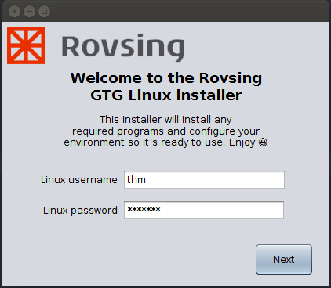
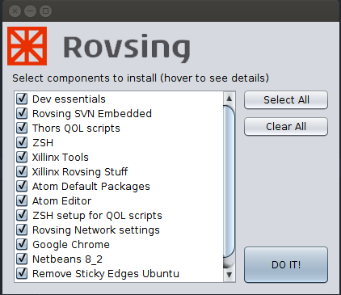
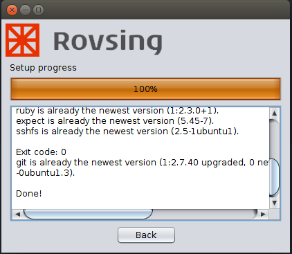
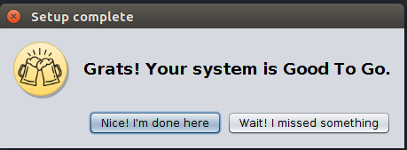

# Universal Linux Environment Installer

## Description
This is a environment installer for Linux that will setup a clean installation of Linux ready to use. It consists of a series of smaller install scripts and GUI to give an overview over the different components to install and enable the user to choose the components to install.
As of now it is not completely automated and actions may still be required from the user under the various installations. Please finish up all external installation procedures before closing the installer as it will cleanup all downloaded installation files when it quits.


#### Supported Distros
- [x] Ubuntu
- [ ] Open SUSE (work in  progress)


## How To Use

Copy/clone the install_script folder to your home folder.
Open a termina and ncvaigate to the install script folder and run the script.

```
cd install_script
./run
```
First the script will update your system and install Java8 to run the installer GUI.
Follow the instructions by the installer

When Java is inatallet you will be greaded by the welcome screen



Make sure the username is correct and type your sudo password in the password field.
The installer will input the password to the scripts that needs it.



Each recepi (install script) is representet as a component in the selction screen.
Select the components that you want to install.
If the recepy has a description it will be shown as a tooltip that will be shown when you hover your mouse over the it.
Some components may depend on echother (it should be clear by the naming)  but for now it is not posible to see dependecys (future improvments).

When you have selected the components to install click the "DO IT" button and the installer will run through the selcted scripts and install/setup the components.



The progress window will show the overall progress og the intalltions and print the ouput from the called scripts.
It may seem nothing is happening but have paythance. The installer is not multithreaded at the momemt (because of dependecyes) and some scripts may do dowloads in the bacground.

Some scripts may be calling external installers that will open windows and requere user interactons.

*** Please finish all externel intstallaions before closing the GTG installer ***

Be aware that the scripts assumes everything is installed at default locations.



When the all the scripts has been run and the installer is finsihed you have the option to go back if you missed something or finish the installer. Be aware that when the installer finsihes it will cleanup the download folder.

If you don't want to run the GUI you can call each install script indivudualy but they assume to be run from the install_script root folder and that argumt 2 and 3 are the username and password respectevly.

## Customization

### How It Works

The GUI will scan all files in the script folder. The file name (file extensions are ignored) will be shown as a install item in the list. I.e “File Name.sh” will be shown as “File Name”. No special characters are allowed (‘“/,). Dots are considered as file extensions delimiter and everything after the dot is not considered part of the item name.

The GUI will scan each file for a description. A description is defined as:

```
if [ "$1" == "-h" ]; then
  echo "This is a description"
  exit 0
fi
```

The description must be the first thing in the script after the shebang (`#!/bin/bash`) else it will be ignored.

At the moment it is not possible to define dependencies but it may be included at a later point.

All scripts is called through the entry_point_script locatet at `resources/worker_scripts/script_entry_point`.
At the moment the entry point is not used for anything but it may be used to defernciate between how scripts should be called (or anything else that shluld be hadle befoe each install script is called)

Stuff that is to cumbersome to download or must be a specefic vesion is placed in the `archive` folder.  

The GUI will use the PNG image located in `resources/company/` folder as the logo and name for the installer.
It should have the dimantions 226x48 pixels and have the comany name as file name (the png extention will be ignored).
If there is no logo in the folder a default name and logo is used.

The GUI source code is included and can be eddited but no dokumention is currently avalubkle for that.

### Things To Consider (quirks and novelties)

When a desciption is found the GUI will call the script with the `-h` argument as the first parameter. Please consider what you put in the descritpin and remember to exit else the script will be run before the user has a chance to choose it.

### Adding New Scripts

Each script should be a selfcointing recepi to install one item.

To add a new script just make a new file in the script folder and give it a meaningfull name. (File extentions are ignored by the GUI). Add the shebang on the first line:
```
#!/bin/bash
```

(As of the time of writing to get the most reliable scripts use bash)

** The script will be called with the following parameters **
* `$1` ** ~> Aboslute path to the script **
* `$2` ** ~> User name **
* `$3` ** ~> User password **


Add a discription that will be shown as a tooltip in the GUI or be printed when the script is called from the command line with the `-h` parameter.

```
if [ "$1" == "-h" ]; then
  echo "This is a description"
  exit 0
fi
```

A number of helper functions are available in the `resources/worker_scripts/helpers` script. To use them add this to your script:

```
. resources/worker_scripts/helpers
```

It is recomended to use the helper funtions as thay have been tested to work with the GUI and will call the funtions with the required arguments and place files at the correct locations.

If you need to download or make temporary files place them in the `resources/downloads/` folder as it will be cleaned every time the GUI quits. The path to the folder is defied in the helpers script as
```
$DOWNLOAD_PATH
```

But remember files here will be deleted :-)


For `sudo` commands use the following to pass password to sudo

```
echo $3 | sudo -S <commadn here>
```

If you have something used by many deifferent install scripts place it in the `resources/worker_scripts/helpers` folder and source it from there (just like the `helpers` script). If you place it in the script folder it will show up as a component in the GUI.

If you need to `echo` into a file with `sudo` do this:
```
echo $3 | sudo -S bash -c 'echo "text to write with '"$VARIABLE_FROM_SCRIPT"'" >> file/path'
```
